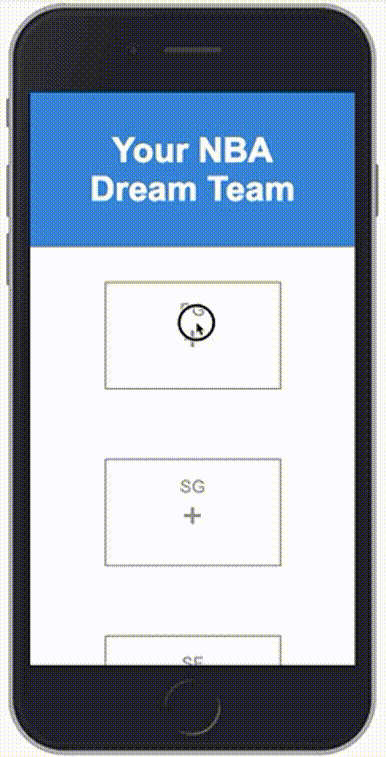

# Your NBA Dream Team

## Overview
An example app for creating a team with your favorite NBA players. This SPA has a mobile-first, fluid layout, and uses the History API (via Backbone.Router) to enable app navigation with the back button.

## Check it out
http://your-nba-dream-team.herokuapp.com

Unit tests: https://your-nba-dream-team.herokuapp.com/_SpecRunner.html

## Technical Highlights
- **Publish/Subscribe** pattern used to prevent global variables (`/app/events.js`)
- Created **RESTful APIs in Node.js** from reformatted data from stats.nba.com
- **Mobile-first**, fluid layout created with the Stylus CSS preprocessor
- Uses **Backbone.js** to modularize code into Models, Views, and Collections
- **Comprehensive Unit Tests** using Jasmine 
- **Grunt** used for compiling templates, combining/minifying JS into one file, running tests, and compiling Stylus
